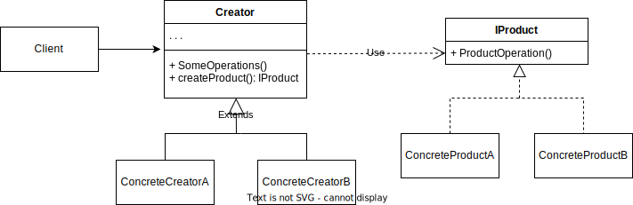

<h1>Creational design pattern - Metoda Wytwórcza</h1>
<h2>Cel</h2>
Metoda wytwórcza jest kreacyjnym wzorcem projektowym, którego celem jest udostępnienie wspólnego interfejsu dla 
obiektów w ramach klasy bazowej. Dzięki temu rozszerzenie aplikacji o nową funkcjonalność, z tej samej rodziny staję
się proste, ponieważ obiekty dziedziczące po klasie bazowej mogą zdecydować o swoim podtypie, implementując wspólny interfejs.

<h2>Rozwiązanie</h2>
Metoda wytwórcza dodaje warstwę abstrakcji - metodę -, która zasłania bezpośrednie wywoływanie konstruktorów obiektów.
Obiekt wygenerowany przez metodę wytwórczą często nazywany jest produktem. 
Wszystkie produkty muszą być zgodne z tą samą klasą bazową lub interfejsem.

<h2>Diagram UML</h2>

IProdukt deklaruje interfejs, który jest wspólny dla jakiejś określonej rodziny produktów.
Jest on wspólny dla wszyskich obiektów zwracanych przez Kreatora i jego podklasy.

Konkretne produkty są konkretnymi implementacjami interfejsu

Kreator deklaruje metodę wytwórczą, która zwraca nowe produkty. Zwracany typ musi być zgodny z interfejsem produktu.

Konkretni twórcy naspisują metodę wytwórczą, co sprawia, że zwraca ona inny typ obiektu z tej samej rodziny.
Warto zapamiętać, że tworzenie produktów nie jest głównym zadaniem Kreatora. Zazwyczaj klasa kratora zawiera już jakąś ważną logikę
biznesową związaną z produktami. Metoda wytwórcza ma za zadanie rozprzęgnąć tę logikę i konkretne klasy produktów. 

<h2>Przykład</h2>
Firma zajmuje się dostarczaniem przesyłek. Udostępnia użytkownikom prostu interfejs użytkownika, który pozwala na szybkie wyklikanie
porządanej formy dostarczenia przesyłki.

Firma wspiera trzy rodzaje transportu: morski, lądowy oraz powietrzny. 
Forma zamówienia dla wszyskich rodzajów transportów jest pod względem abstrakcji taka sama.
Należy odpowiednio oznaczyć oraz zapakowac przesyłkę, a na koniec przetransportować.

Produktem w tym wypadku jest dany typ transportu.
Kreatorem może być klasa, która zleca oznaczenie oraz zapakowanie przesyłki, jeżeli czynności te są takie same dla wszyskich transportów,
to posiadamy klasę bazową, jeżeli są różne, to możemy je zaimplementować w konkretnym Kreatorze.

Na koniec kiedy mamy już gotowe zamówienie możemy wywołać metodę transportuj konkretnego typu.
W zależności od wybranego typu transportu przez użytkownika, zostaje wytworzony dany typ Kreatora.
